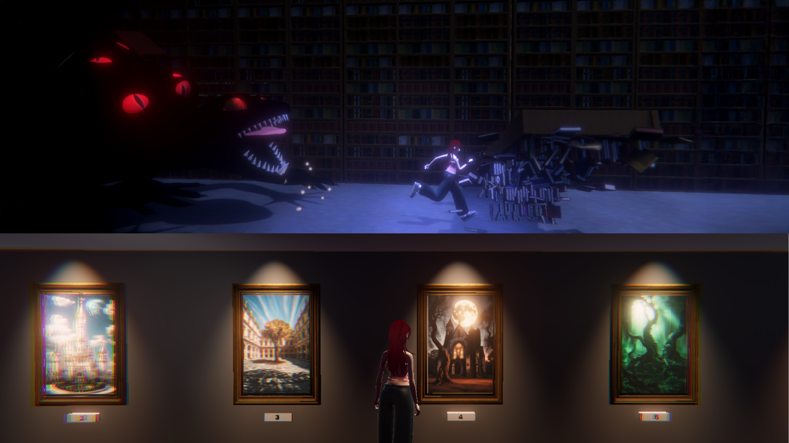
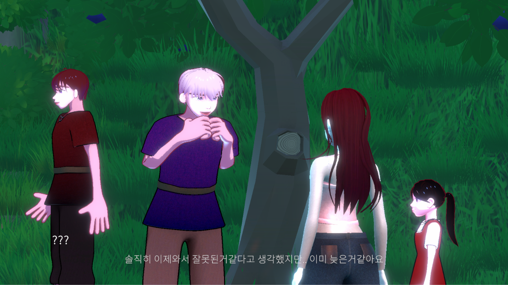
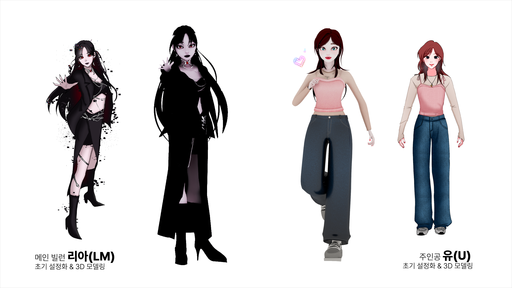
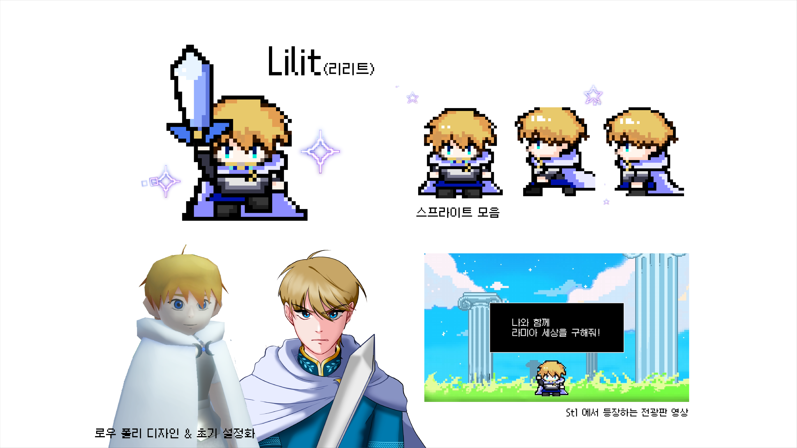
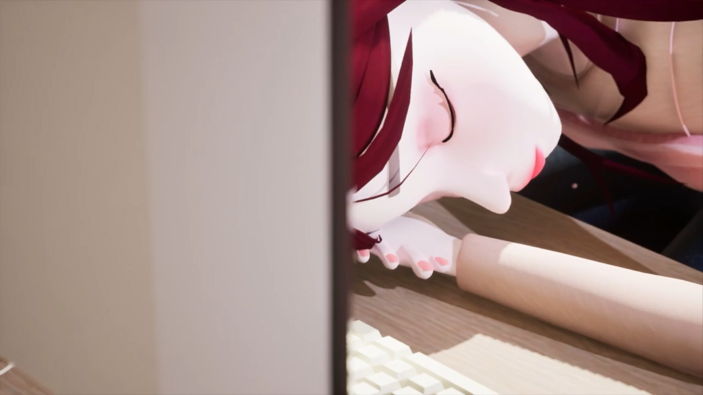
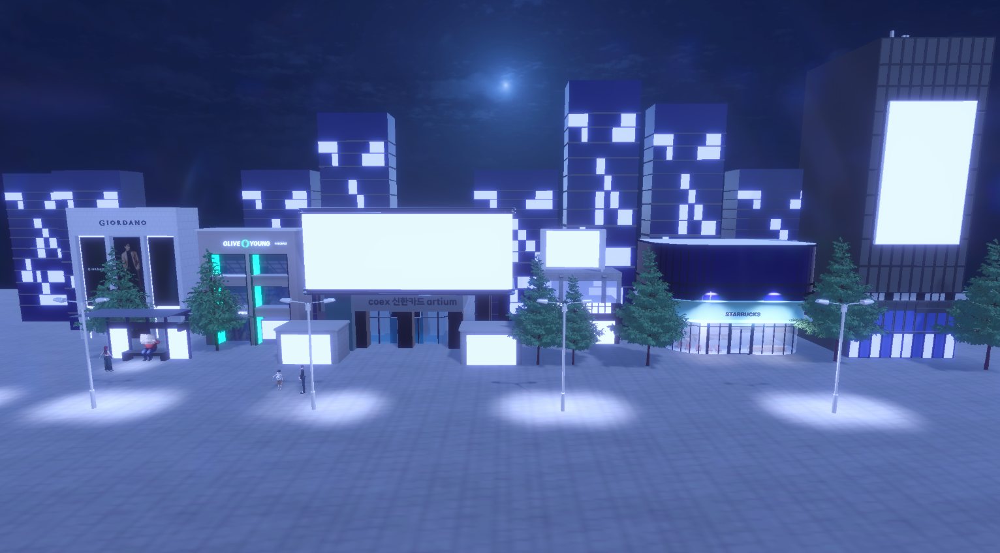

<!-- 

  

    <h3 class="title is-1">Remind Lamia</h3>
    

      

        주인공 <strong>'유'</strong>는 어릴 적부터 좋아했던 게임 속 캐릭터 <strong>'리리트'</strong>와 만나 
        가상과 현실이 뒤섞인 세계를 모험하며, 위기에 빠진 세상을 구하는 
        3D 어드벤처 게임입니다.
      

    

  

  

### Game Play

  
  

  
다양한 스테이지를 돌아다니며 퍼즐을 풀고, 캐릭터와 상호작용을 하며 스토리를 진행할 수 있습니다

### Concept art

  
  

  

    <h4 class="title is-4">🎮 유</h4>
    

      어렸을 때부터 <strong>고전 라미아 어드벤처</strong>를 좋아하던 대학생. 
      현실 세계에 나타난 리리트를 처음엔 당황스럽게 여기지만, 
      함께 위기에 빠진 세상을 구하기 위해 모험을 떠납니다.
    

    
<strong>성격:</strong> 호기심이 많고 정의감 넘침

    
<strong>특징:</strong> 리메이크된 라미아 어드벤처는 아직 해보지 않음

  

  

    <h4 class="title is-4">🗡️ 리리트</h4>
    
<strong>라미아 어드벤처</strong> 속 바빌렌 왕국을 지키는 용사. 
      오랫동안 유의 플레이를 지켜보며 유대감을 쌓아왔습니다. 
      리메이크된 게임으로 인한 위기를 느끼고, 현실 세계로 나와 
      유와 모두를 지키기 위한 여정에 나섭니다.
    

    
<strong>성격:</strong> 강인하고 책임감 있지만 내면은 따뜻함

    
<strong>특징:</strong> 마법의 검으로 오염된 것을 정화하는 마법 사용 가능

  

  
  

  
게임 속 몰입감을 더하는 애니메이션 컷씬과 아름다운 맵들을 만나보세요

<!-- Team Polaris 구간 앞에 마진 추가 -->
<!-- 

  <h3 class="title is-3"><strong>Team Polaris</strong></h3>
  Leader & Art 김예린   
  Game Design & script 김예빈 
  Programmer 권경현  

 --> 

<!DOCTYPE html>
<html lang="ko">
<head>
  <meta charset="UTF-8" />
  <meta name="viewport" content="width=device-width, initial-scale=1.0"/>
  <title>My Game Website</title>
  
</head>
<body>
  <header>
    
  </header>

  <section class="section">
    <h2>About the Game</h2>

    <!-- 영상 태그 확인용 preload 추가 -->
    

      

        <video src="assets/drawpuzzle_1.mp4" autoplay muted loop playsinline preload="auto"></video>
      

      

        리리트와 함께 오염된 게임 세계를 다시 되돌려주세요 [그림퍼즐]
      

    

    

      

        <video src="assets/jumpmap_1.mp4" autoplay muted loop playsinline preload="auto"></video>
      

      

        오염된 라미아 어드벤쳐 3D 게임의 영향으로 인해 납치된 사람들의 행방을 찾아야합니다 [점프맵]
      

    

    

      

        <video src="assets/pannelpuzzle_1.mp4" autoplay muted loop playsinline preload="auto"></video>
      

      

        현실과 게임 속 세상이 뒤섞인 가상의 공간에서 퍼즐을 진행하며 나아가게 됩니다 [패널보드]
      

    

    

      

        <video src="assets/runandgun_1.mp4" autoplay muted loop playsinline preload="auto"></video>
      

      

        리리트와 유를 방해하는 괴물을 조심하세요! 오염된 게임 속 세상의 영향이 커질수록 현실과 가상의 경계가 점점 무너집니다
      

    

    

      

        <video src="assets/bullethell_1.mp4" autoplay muted loop playsinline preload="auto"></video>
      

      

        실종된 사람들의 행방을 좇아 모든 일의 배후를 조사하세요. 최종보스 LIA를 무찔러 납치된 사람들을 리리트와 함께 구해야 합니다
      

    

    

      

        <video src="OP_1.mp4" autoplay muted loop playsinline preload="auto"></video>
      

      

        게임 속 아름다운 애니메이션과 컷씬을 확인하세요
      

    

  </section>

  <section class="section stage-section">
    <h2>Stages</h2>
    

스테이지 1 설명

    

스테이지 2 설명

    

스테이지 3 설명

    

스테이지 4 설명

    

스테이지 5 설명

    

스테이지 6 설명

    

스테이지 7 설명

  </section>

  <section class="section" id="characters">
    <h2>Characters</h2>
    

      

        
<h3>Character Name 1</h3>
설명 1줄~3줄 정도의 캐릭터 소개.

        
<h3>Character Name 2</h3>
설명 1줄~3줄 정도의 캐릭터 소개.

        
<h3>Character Name 3</h3>
설명 1줄~3줄 정도의 캐릭터 소개.

        
<h3>Character Name 4</h3>
설명 1줄~3줄 정도의 캐릭터 소개.

        
<h3>Character Name 5</h3>
설명 1줄~3줄 정도의 캐릭터 소개.

        
<h3>Character Name 6</h3>
설명 1줄~3줄 정도의 캐릭터 소개.

      

      

        <button onclick="moveCarousel(-1)">&larr;</button>
        <button onclick="moveCarousel(1)">&rarr;</button>
      

    

  </section>

  <section class="team-section">
    <h2>Team Members</h2>
    
<strong>ddd</strong> - 게임 기획 및 시스템 디자인 담당

    
<strong>sss</strong> - 캐릭터 아트 및 애니메이션 담당

    
<strong>aaa</strong> - 프로그래밍 및 구현 담당

  </section>

  <footer>
    &copy; 2025 Your Game Studio. All rights reserved.
  </footer>

  
</body>
</html>

