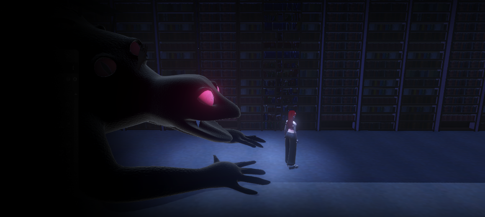
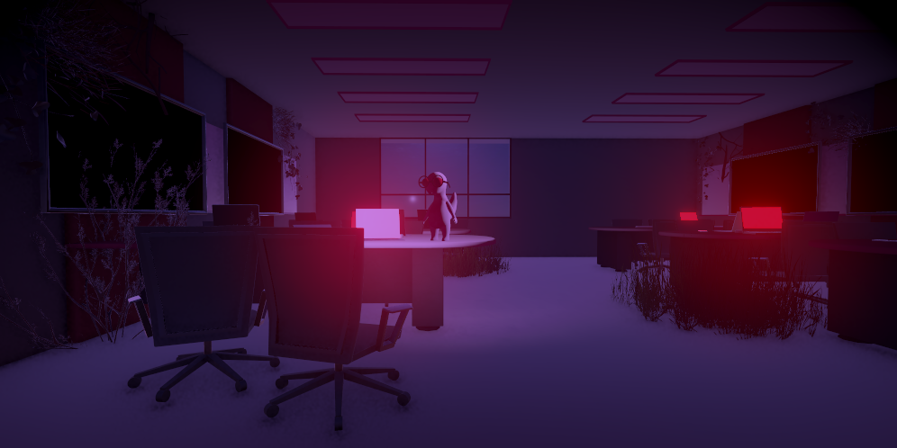
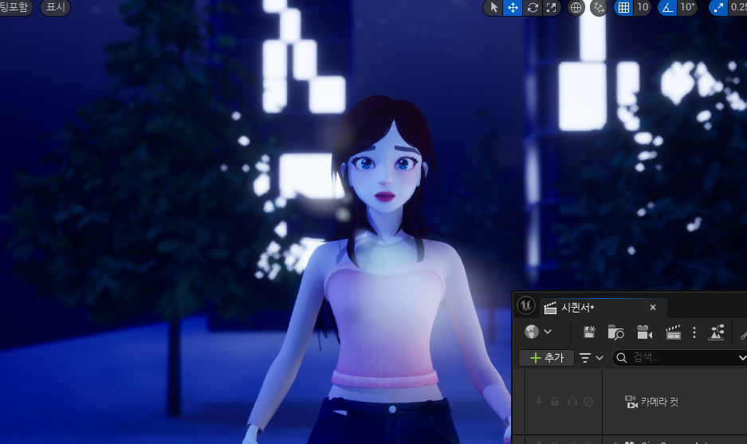

  

    <h2>Game Introduction</h2>
    

      "Remind Lamia"는 주인공인 유가 어렸을 때부터 좋아했던 게임 캐릭터인 리리트와 만나 모험을 떠나고, 위험에 빠진 세상을 구하러가는 게임입니다 
    

  

## SIDL Dataset 

  
  

### Full-resolution images (4032x3024)

  

### RAW files

  
  

### Online Evaluation  
We also provide RAW image files (DNG) along with metadata.

  

  
Click the button above to evaluate your model on the SIDL benchmark.

### ISP pipeline
Coming soon

