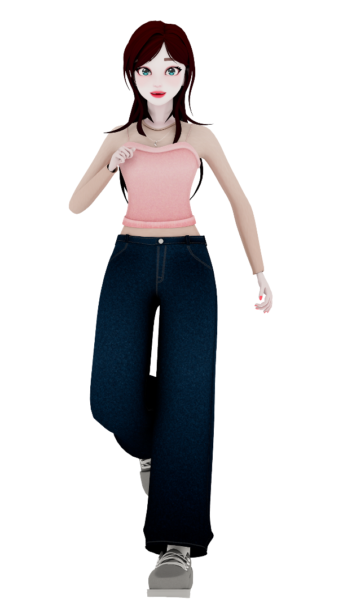
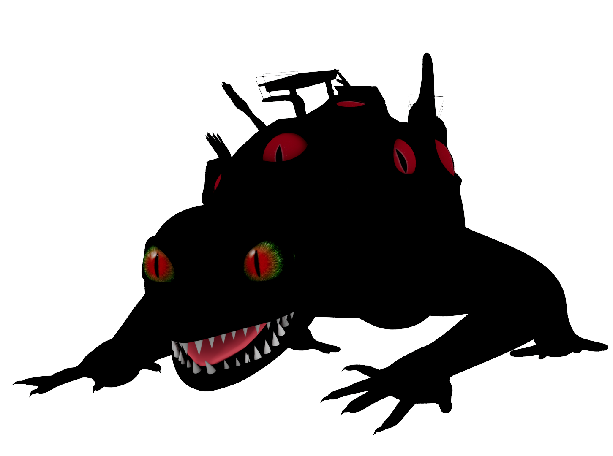

<!DOCTYPE html>
<html lang="ko">
<head>
  <meta charset="UTF-8" />
  <meta name="viewport" content="width=device-width, initial-scale=1.0"/>
  <title>My Game Website</title>
  
</head>
<body>
  <header>
    
    

      <h1>리마인드 라미아</h1>
    

    

      
<strong>“게임 속 주인공과 함께, 현실과 가상을 구하는 모험이 시작된다.”</strong>

      

        고전 게임인 <strong>라미아 어드벤쳐</strong>의 리메이크작 <strong>라미아 어드벤쳐 3D</strong>가 현대에서 큰 인기를 끌던 중, 
        게임을 플레이한 사람들이 차례로 실종되는 기묘한 사건이 벌어집니다. 
        고전 게임을 좋아하던 <strong>유</strong>는, 라미아 어드벤쳐의 용사이자 주인공인 <strong>리리트</strong>와 함께 
        현실과 가상이 뒤엉킨 세계의 비밀을 파헤치고,  
        위기에 빠진 세상을 구하기 위한 여정을 떠나게 됩니다.
      

    

  </header>

  <section class="section">
    <h2>About the Game</h2>

    

      

        <video src="asset/drawpuzzle_1.mp4" autoplay muted loop playsinline preload="auto"></video>
      

      

        유는 리리트와 함께 퍼즐과 비밀들로 가득찬 세계를 돌아다니게 됩니다
      

    

    

      

        <video src="asset/jumpmap_1.mp4" autoplay muted loop playsinline preload="auto"></video>
      

      

        오염된 라미아 어드벤쳐 3D의 영향으로 인해 납치된 사람들의 행방을 조사합니다 
        납치된 사람들이 게임 속 NPC의 모습으로 변하기 전에 그들의 흔적을 찾아주세요 
      

    

    

      

        <video src="asset/pannelpuzzle_1.mp4" autoplay muted loop playsinline preload="auto"></video>
      

      

        현실과 게임 속 세상이 뒤섞인 가상의 공간에서 
        퍼즐을 진행하며 나아가게 됩니다
      

    

    

      

        <video src="asset/runandgun_1.mp4" autoplay muted loop playsinline preload="auto"></video>
      

      

        리리트와 유를 방해하는 괴물을 조심하세요! 
        오염된 게임 속 세상의 영향이 커질수록 현실과 가상의 경계가 점점 무너집니다
      

    

    

      

        <video src="asset/bullethell_3.mp4" autoplay muted loop playsinline preload="auto"></video>
      

      

        실종된 사람들의 행방을 쫓아 모든 일의 배후를 조사하세요. 
        최종보스 LIA를 무찔러 납치된 사람들을 리리트와 함께 구해야 합니다
      

    

    

      

        <video src="asset/OP_1.mp4" autoplay muted loop playsinline preload="auto"></video>
      

      

        게임 속 아름다운 애니메이션과 컷씬들을 즐겨주세요 
      

    

  </section>

  <section class="section stage-section">
    <h2>STAGE</h2>
    

      리마인드 라미아는 유의 방부터 라미아 어드벤쳐 3D 게임 속 세상까지 7개의 스테이지들로 구성되어있습니다. 
      현실과 가상을 넘나드는 맵들을 체험해보세요
    

    
    

      
      
Stage 1 유의 방

    

    

      
      
Stage 2 도시

    

    

      
      
Stage 3 가상의 도시

    

    

      
      
Stage 4 학교

    

    

      
      
Stage 5 가상의 학교

    

    

      
      
Stage 6 라미아 어드벤쳐 3D

    

    

      
      
Stage 7 LIA

    

  </section>

  <section class="section" id="characters">
    <h2>Characters</h2>
    

      

        
<h3>유</h3>
유는 게임 속 캐릭터 리리트와  함께 모험을 떠나는 리마인드 라미아의 주인공입니다

        
<h3>리리트</h3>
고전 게임 라미아 어드벤쳐의 주인공인 리리트는 유가 있는 세상이 위험에 처한걸 느끼고 현실로 나와 유와 함께 모험을 하게됩니다

        
<h3>LIA</h3>
라미아 어드벤쳐 3D를 관리하는 AI였습니다. 어느 순간 LIA가 게임의 통제권을 갖게되고, 플레이한 사람들이 납치되는 이상한 현상이 일어나게 됩니다

        
<h3>버스정류장의 아저씨</h3>
이 NPC는 언뜻 보기에 평범해 보이지만... 관리형 AI의 도입으로 인해 게임회사에서 정리해고를 당한 슬픈 사연을 갖고 있습니다

        
<h3>미니 라미안</h3>
원래는 라미아 어드벤쳐 3D 속 캐릭터 중 하나였지만, 실종된 사람들이 점점 미니 라미안들의 모습으로 변해가고 있습니다

        
<h3>도서관의 괴물</h3>
오염된 라미아 어드벤쳐 3D의 영향으로 학교 도서관에서 생겨난 끔찍한 존재입니다. 리리트와 유가 사람들을 구하는데 방해하게 됩니다

      

      

        <button onclick="moveCarousel(-1)">&larr;</button>
        <button onclick="moveCarousel(1)">&rarr;</button>
      

    

  </section>

  <section class="team-section">
    <h2>Team Polaris</h2>
    
<strong>김예린</strong> - 팀장, 3D/2D 디자인 기획 및 제작, 언리얼 컷씬 기획 및 총 제작, 캐릭터 디자인 ,애니메이팅 ,부스 기획 아트 작업 노션: https://www.notion.so/Remind-Lamia-1f79b79b4d3f80c59ff8fa18143d0068?pvs=4

    
<strong>김예빈</strong> - 시나리오, 스크립트, 게임 컨셉, 맵 구조, 퍼즐/시스템 기획, 사운드, 연출, 컷씬, 트레일러 및 일부 영상 에셋 제작

    
<strong>권경현</strong> - 게임 클라이언트 개발(유니티)

  </section>

  <footer>
    &copy; 2025 Team Polaris. All rights reserved.
  </footer>

  

</body>
</html>

